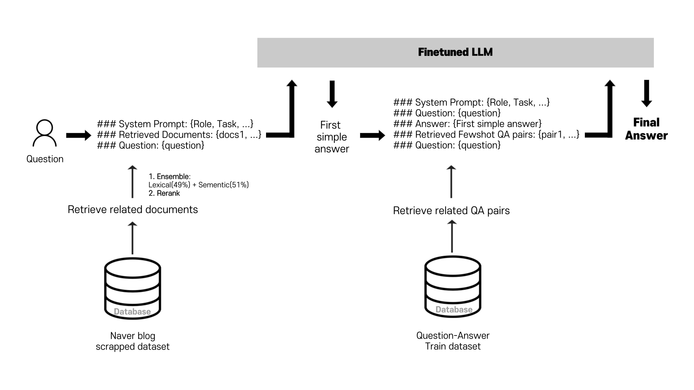
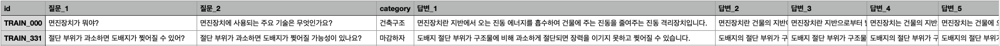
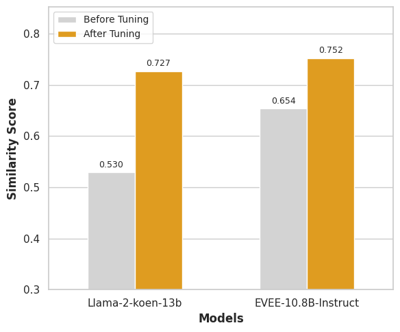
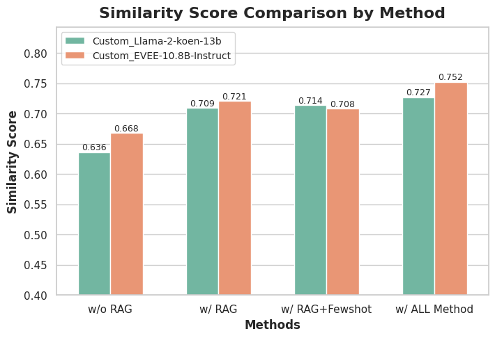
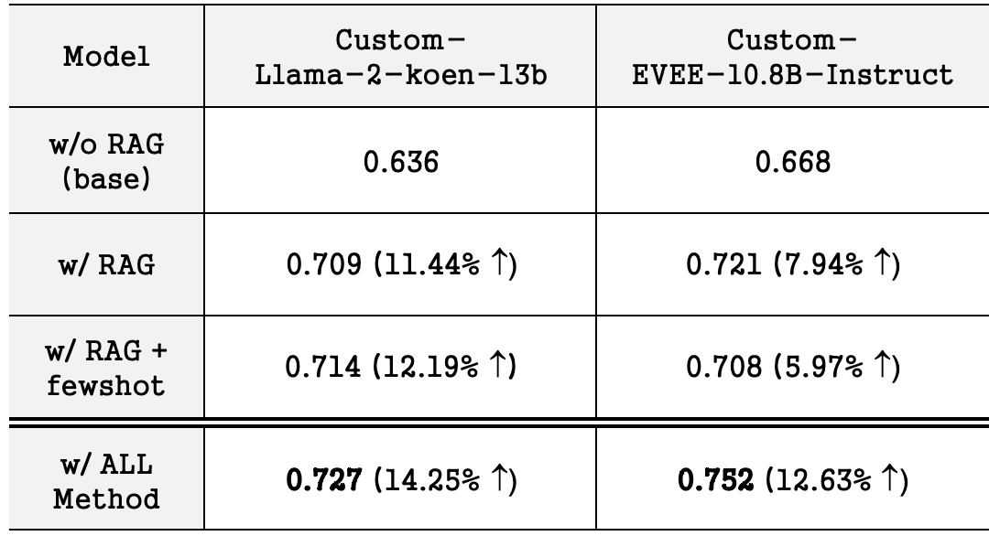

# Interior_Defect_QA_LLM
건축구조, 인테리어, 도배 및 마감 하자에 관련한 도메인에서 질문-대답을 수행할 수 있는 Finetuned LLM

## Description
### 1. Question-Answer 아키텍처 (feat RAG)  

    
     
[그림 1] 전체 시스템 아키텍쳐 구성도

### 2. Model
허깅페이스에서 해당 모델을 확인하실 수 있습니다.  
두 모델 모두 continual pretrainig & supervised finetuing 하였습니다.
- EVEE-Instruct-korean-10.8b 기반 Customized 모델
    - 링크: https://huggingface.co/DinoTheLewis/EVEE-Instruct-Interior-10.8B
- Llama-2-koen-13b 기반 Customized 모델
    - 링크: https://huggingface.co/DinoTheLewis/Llama-2-koen-Interior-SFT-13B
    
### 3. Metric
**생성된 Answer를 512차원으로 임베딩한 벡터의 Cosine Similarity 평균값**을 Metric 으로 사용하였습니다.  
(SentenceTransformers 라이브러리로 Embedding vector 변환)  
정답 Answer sentence와 생성된 Answer sentence의 임베딩 벡터가 서로 얼마나 유사한지를 비교하였습니다.

## Dataset
### 1. 기본 학습데이터세트
기본 학습데이터세트로는 다음 데이터세트를 사용하였습니다.  

- 학습 데이터세트: [데이콘 경진대회(도배 하자 질의 응답 처리)](https://dacon.io/competitions/official/236216/data)
    - train 644 rows
    - test 130 rows  

다음과 같은 7개의 카테고리를 가지고 있으며, 1 row는 두 가지의 질문 형태와 다섯가지의 답변 형태로 구성되어있습니다.  
- 카테고리: 건축구조, 기타, 마감하자, 마감재, 시공, 인테리어, 타 마감하자
- 예시 데이터세트:  

    
    
[표 1] 주어진 학습데이터 예시

### 2. 데이터세트 증강  

|Index|증강기법종류|설명|사용한 모델|데이터 크기|예시|
|:---:|:---|---:|---:|---:|:---|
|1|`Lecture Note`|대학(원)생들을 대상으로 하는 수업자료 형태로 해당 도메인에 대한 한국어 실력 향상을 유도|GPT 3.5||"안녕하세요 여러분, 오늘은 벽체 결로의 잠재적인 위험성에 대해 알아보겠습니다. \n\n첫째, 벽체 결로는 건물 내부 환경을 악화시킬 뿐만 아니라  ... (중략) ... 넷째, 이러한 잠재적인 위현성으로 인해 우리는 어떻게 해결하고 예방해야 할까요? \n우선은 단열 성능 향상 및 내부 수증기 관리를 통해 벽체 결로를 예방하는 것이 중요합니다. ... (중략) ... 오늘 준비된 정보들이 여러분들에게 도움이 되었기를 바랍니다."|
|2|`Translated Lecture Note`|대학(원)생들을 대상으로 하는 고품질의 수업자료를  영어로 생성한 뒤 다시 한글로 번역한 형태로 수업자료에 해당 도메인의 전문용어 포함 비율을 높임|GPT 3.5, Gemini Pro 1.0||"좋은 아침입니다, 여러분. 오늘은 건축에서 아연 패널을 사용하는 것의 장단점에 대해 논의할 것입니다.\n\n아연 패널은 아연 도금 강철로 만든 ... (중략) ...   **지속 가능성:** 아연은 여러 번 재활용할 수 있는 지속 가능한 재료입니다. 또한 환경에 유해한 화학 물질을 배출하지 않는 천연 소재입니다.\n* **미학:** 아연 패널은 독특하고 매력적인 외관을 가지고 있습니다. ... (중략) ... **결론**\n\n아연 패널은 다양한 용도로 사용할 수 있는 다재다능하고 내구성 있는 재료입니다. ... (중략) ...   많은 경우 아연 패널은 다양한 용도에 적합한 선택이 될 수 있습니다.\n\n감사합니다."|
|3|`Code Switching`|한 문장 내에서 영어와 한글이 섞여있는 형태(pangyo)로  모델의 기존 영어 언어실력과 한국어 언어실력의  Alignment를 유도|Gemini Pro 1.0||"Good morning, everyone. 오늘은 architecture에서 아연 패널을 사용하는 장점과 단점에 관해 discuss 하겠습니다.\n亜鉛(아연) 패널은亜鉛(아연) 도금 강철로 만든 ... (중략) ... **Sustainability:** Zinc는 여러 번 recycle할 수 있는 sustainable한 material입니다. 또한 환경에 harmful한 화학 물질을 배출하지 않는 natural 소재입니다.\n **esthetics:** 아연 패널은 distinctive하고 attractive한 외관을 가집니다. ... (중략) ... **결론**\n아연 패널은 versatile하고 durable한 material로, 다양한 application에 사용할 수 있습니다. 뛰어난 튼튼함, lifespan, 지속 가능성, 그리고 aesthetics을 포함한 몇 가지 merit를 제공합니다. 반면에 비용, installation, 무게, noise, 그리고 stain과 같은 몇 가지 염두에 두어야 할 drawbacks도 있습니다. ... (중략) ...  많은 경우 아연 패널은 variety한 용도에 적합한 choice가 될 수 있습니다.\n감사합니다. thank you."|

[표 2] 증강 데이터세트 기법 및 설명
  

### 2-1. 데이터 증강의 근거
2.1. `Lecture Note`:  
[TinyStories](https://arxiv.org/abs/2305.07759), [Textbooks are all you need]() 두 논문에서 사용한 데이터 생성 방식으로부터 관련 도메인의 고품질 데이터 생성 아이디어를 얻었습니다.  
1번의 기본 학습데이터세트로부터 Textbook으로 제작할 만한 '주제'를 추출하여 관련 도메인의 대학(원)생들을 대상으로 수업할 Textbook을 제작하도록 하였습니다.    
GPT3.5, Gemini pro 1.0 API 를 사용하여 생성하였습니다.  

2.2. `Translated Lecture Note`:  
1 번 방식으로 생성한 Lecture Note 데이터세트가 전문용어의 사용 빈도가 낮고 '고품질'이라고 판단하기 어려워, GPT API와 Gemini API의 어휘능력을 최대로 사용하고자 '영어 데이터 생성 후 한글로 번역' 과정을 거쳐 추가 Lecture Note 데이터세트를 생성하였습니다.  
GPT3.5, Gemini pro 1.0 API 를 사용하여 생성하였습니다.  

2.3. `Code Switching`:  
[코드 스위칭 코퍼스 기반 다국어 LLM의 지식 전이 연구](https://github.com/MrBananaHuman/PangyoCorpora/blob/main/Knowledge%20Transfer%20in%20Multilingual%20LLMs%20Based%20on%20Code-Switching%20Corpora.pdf) 논문의 핵심은, pre-training 문장을 영어와 한국어가 번갈아 있는 형태로 구성하여 학습할 시, 기존 영어 지식이 전이되어 한국어 능력도 향상된다는 점 입니다. 이에 아이디어를 얻어, Gemini API를 사용하여 2 번 방식으로 생성한 고품질 Lecture Note 데이터세트를 영어와 한국어가 번갈아있도록 변형하여 code switching 데이터세트를 생성하였습니다. 이를 통해 모델이 가지고 있는 특정 도메인의 기존 영어지식을 한국어로 전이할 수 있도록 유도하였습니다.  
Gemini pro 1.0 API 를 사용하여 생성하였습니다.  

(그림 추가) (1번 예시 데이터 -> 프롬프트 -> 주제 추출 -> Lecture 생성)

### 2-2. 최종 학습 데이터세트
rows:  
size:  
#of tokens:  

## 참고자료
*Finetuning Tool
- Axolotl

*데이터 증강 참고 논문:
- [TinyStories: How Small Can Language Models Be and Still Speak Coherent English?(R Eldan, et al, 2023.05)](https://arxiv.org/abs/2305.07759)
- [Textbooks Are All You Need(S Gunasekar, et al, 2023.06)](https://arxiv.org/abs/2306.11644)
- [코드 스위칭 코퍼스 기반 다국어 LLM의 지식 전이 연구(김성현 외 3인, 2023)](https://github.com/MrBananaHuman/PangyoCorpora/blob/main/Knowledge%20Transfer%20in%20Multilingual%20LLMs%20Based%20on%20Code-Switching%20Corpora.pdf)

*프롬프트 엔지니어링 참고 논문:
- [Re-Reading Improves Reasoning in Large Language Models](https://arxiv.org/abs/2309.06275)
- [Chain-of-Verification Reduces Hallucination in Large Language Models](https://arxiv.org/abs/2309.11495)
- [Principled Instructions Are All You Need for Questioning LLaMA-1/2, GPT-3.5/4](https://arxiv.org/abs/2312.16171v1)
- etc.

## Final Result  

    
     
[그래프 1] 기존 모델과 튜닝 모델의 sentence similarity score 비교

## RAG를 통한 성능 향상 비교

    
    
    
[그래프 2 (좌)] RAG, fewshot 방법 별 sentence similarity score 비교, [표 2(우)] 그래프 2의 성능 향상폭 시각화

방법별 Finetuned LLM의 성능을 비교하면 그래프 [2]와 같습니다.  
(Detailed explanation 추가 예정)